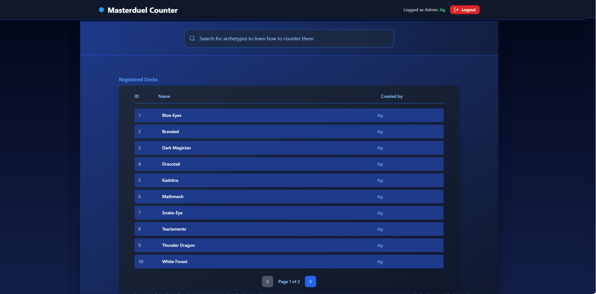
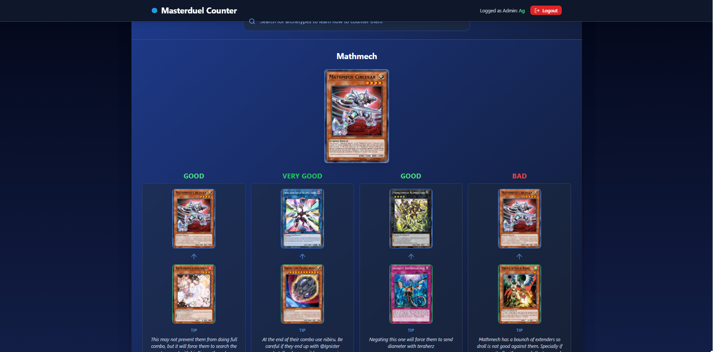
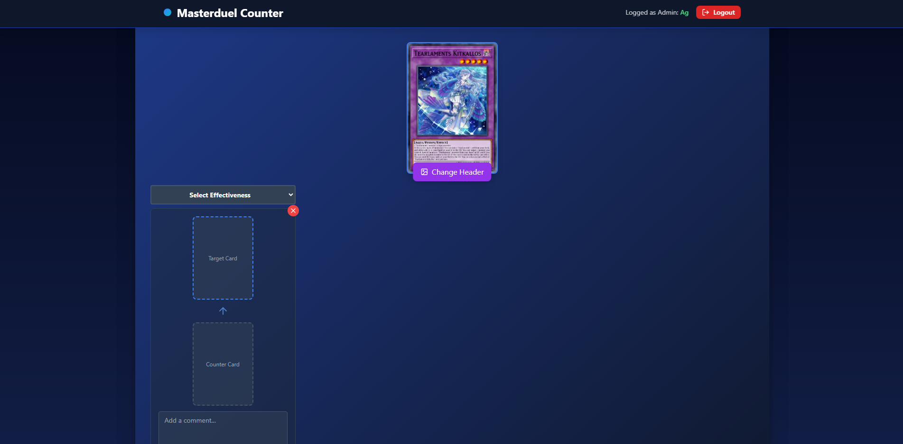

# Master Duel Counter

## Admin Login System

To create an admin user in the database, `backend/npm run create-admin`
You can access to the login page at `http://localhost:5173/signAsAdmin`

#### Preview

Homepage

Archetype counter setup

Edit-mode

For now, only admins can create archetypes and mark them as registered, but this will change in future updates when we have user system implemented.