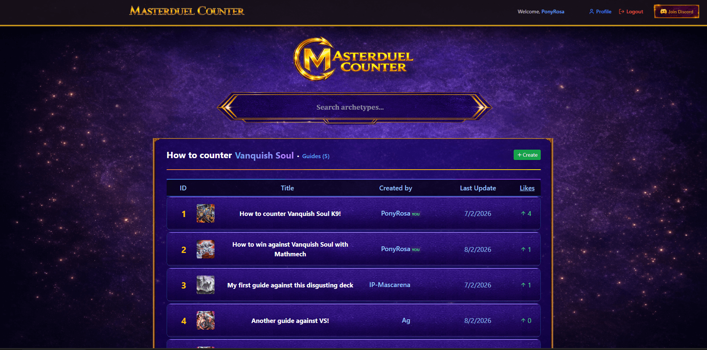
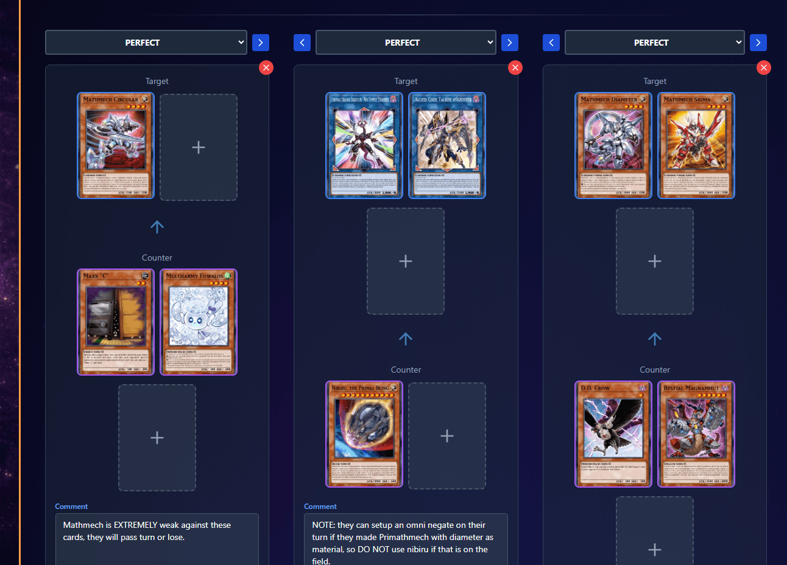
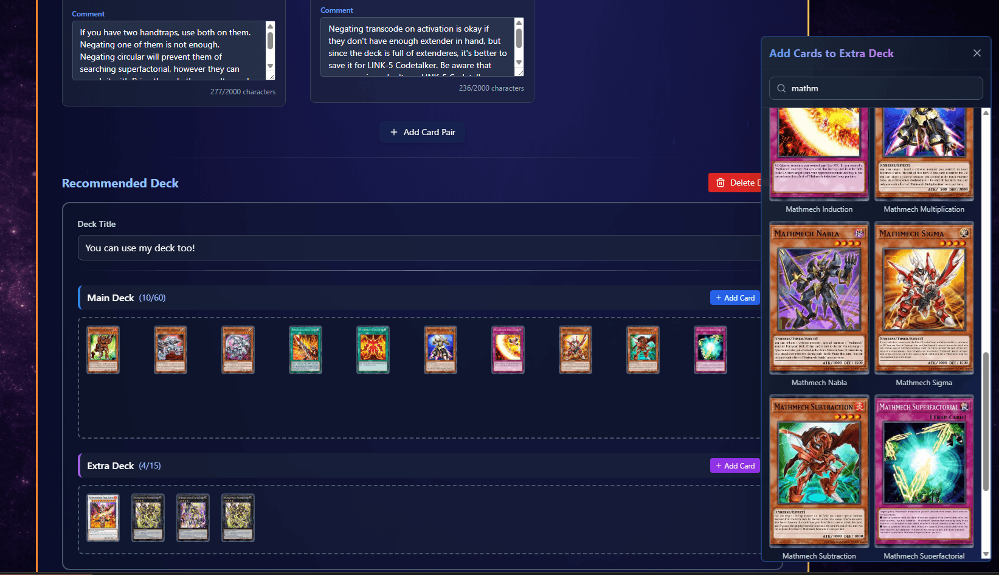

# Master Duel Counter

This app is meant to help players so they when and why use each handtrap/card agianst different archetypes. In the future we will let users to create their own counter-guides and share them with the community.

#### Features
- Create and share your own counter-guide
- Search for archetypes and see the best handtraps/cards to use against them
- Instances table (ordered by date or likes)
- Edit your profile
- Admin panel (only for admins)

#### Preview

Homepage

Archetype counter setup

Edit-mode

You can check all preview images in the [assets/showcase](./assets/showcase) folder.

### Stack used

- Node/Express
- Better-sqlite3
- BetterAuth
- Prisma
- Multer
- bcrypt
- Cloudinary
- React
- Cloudinary react
- TailwindCSS
- Tanstack/query
- Axios