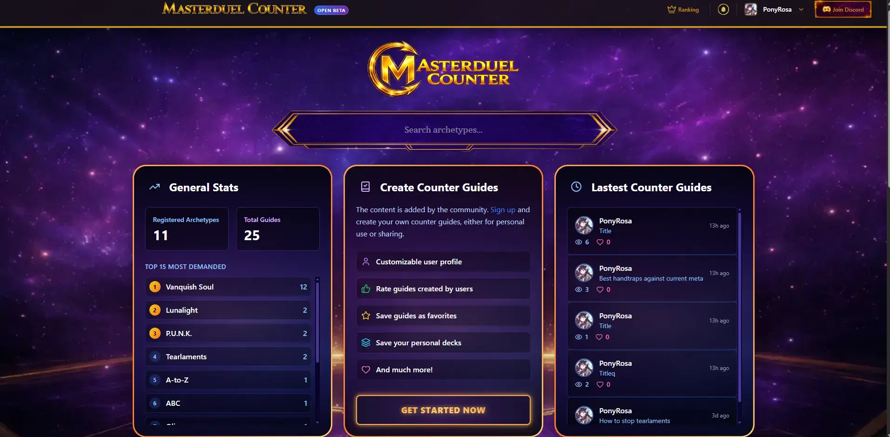
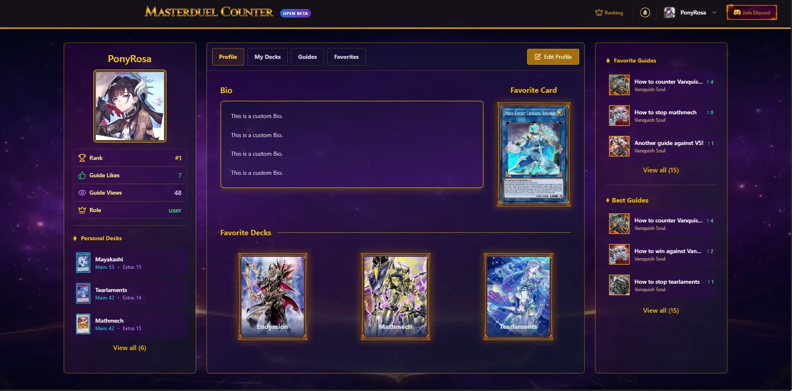

# Master Duel Counter

This app is meant to help players so they when and why use each handtrap/card agianst different archetypes. In the future we will let users to create their own counter-guides and share them with the community.

#### Features
- Counter guides
- Search for archetypes and find their guides created by users
- Guides table (ordered by date or likes)
- Profiles
- Personal Deck builder, save guides as favorites
- Notifications
- Ranking
- Report system
- Admin panel

#### Preview

Homepage

Profile

Guides

You can check all preview images in the [assets/showcase](./assets/showcase) folder.

### Stack used

- Node/Express
- Better-sqlite3
- BetterAuth
- Prisma
- Cloudinary
- React
- TailwindCSS
- Tanstack/query
- Axios